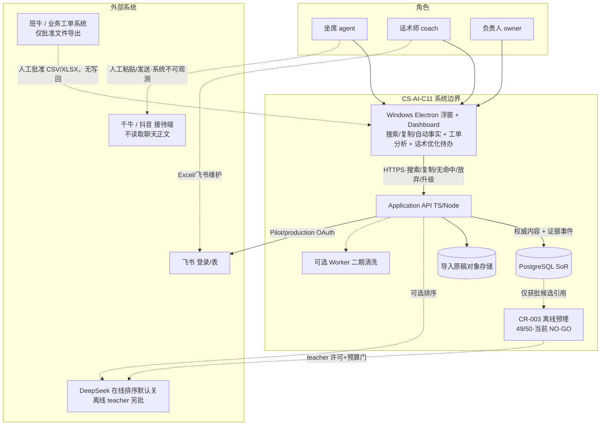
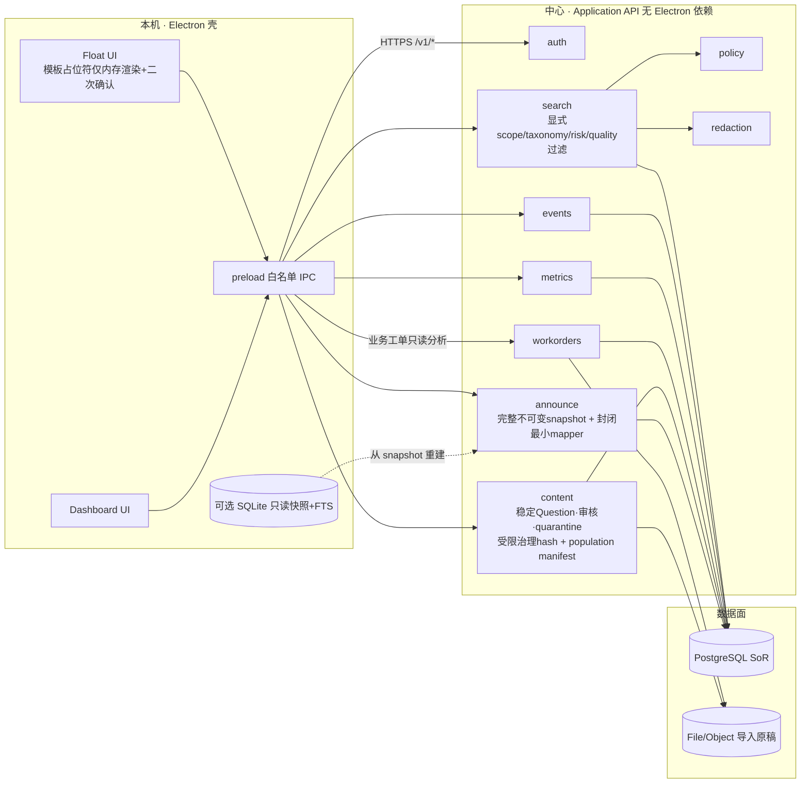
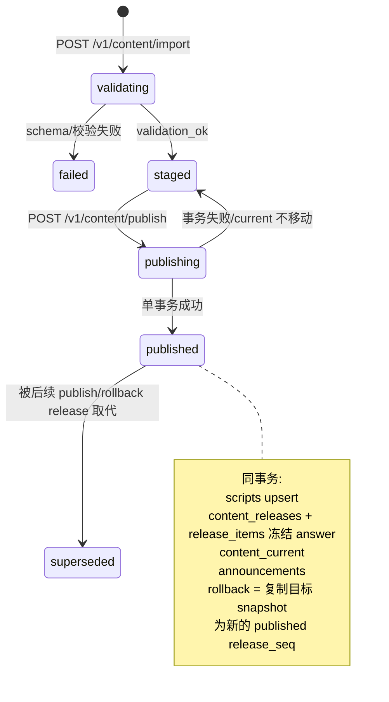
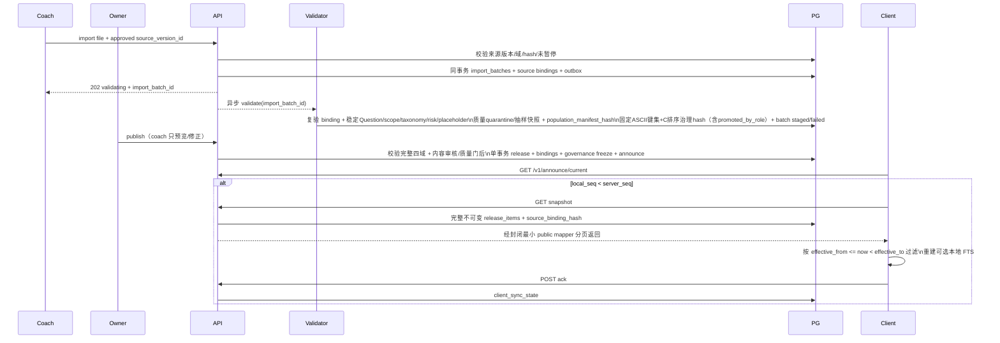
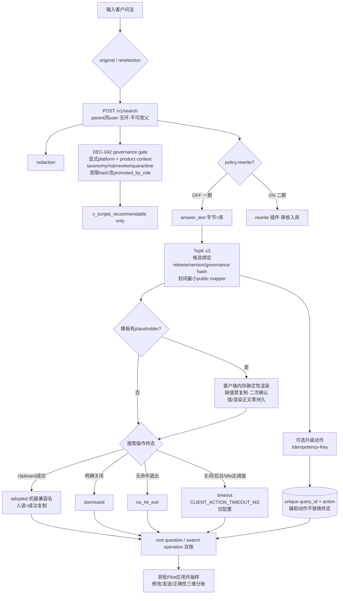

# 40 · 架构图设计 + 瀑布关卡状态

> **状态：** 架构设计关 **PASS-WITH-CONDITIONS（静态设计）**；实现设计关 **Pass · 文档包 Ready** · 2026-08-13 · **v1.21 · CR-002、CR-003、CR-004、DEC-042、扩展治理、当前 reference DDL 本地隔离 PG15 预检、费用路径、G0-14 WBS / 容量 / 成本与既有责任包已纳入静态增量复核**\
> **权威：** 服从 [`37-架构SSOT-v1.md`](37-架构SSOT-v1.md)\
> **API：** [`39`](39-API合同与发布状态机-v1.md) · **SoR：** [`33`](33-schema-v1-草案.sql) · **NFR：** [`41`](41-NFR扩展并发与防改崩.md)\
> **增量设计：** [`47-CR-002搜索复制证据闭环.md`](47-CR-002搜索复制证据闭环.md) · [`48-CR-002测试计划.md`](48-CR-002测试计划.md)\
> **训练预埋：** **49 / 50**（CR-003 设计与测试职责；不新增一期 public 训练 API）\
> **推荐图站：** [`架构图-PlantUML浏览器.html`](架构图-PlantUML浏览器.html) · **可编辑图源：** [`diagrams/`](diagrams/)\
> **用途：** 大项目架构师一眼读图；瀑布流 Owner 一眼看关卡\

---

## 0. 现在什么样子（一句话）

**需求分析关通过 → 架构设计关 PASS-WITH-CONDITIONS（含 CR-002、CR-003、CR-004、DEC-042 与扩展治理静态增量）→ 实现设计关 Pass · 文档包 Ready（46）→ 当前停在独立的第 3→4 关组织授权门；G0 / Ddev 均未授权，代码开发未开始。**\
不是运行时已上线；是**技术设计三关已收口，等待组织授权**。

这里的“静态”是证据标签：图、合同和不变量已完成设计态闭环；真实数据库、身份、代码、压测、恢复和真机证据按瀑布关卡在实现/测试/发布阶段补齐，不把后续证据倒灌成架构设计未通过。

**2026-08-21 PG 证据校正：** ENG-T1 修正后的当前 `schema.v1.12` clean-install reference DDL（SHA-256 `47b667958e522a28df1c04d7c79a56c930bfe0ac04598321824b55744ac4a801`）已在本机隔离 PostgreSQL 15.18 通过 40 tables / 2 views / 143 functions clean-install、ACL 8/8、约束 3/3、ACK runtime wrapper 正向/幂等/异体冲突、完整幂等重跑与 COMMIT 前故障原子回滚，结果 **PASS-WITH-LIMITATION**，证据 `EVD-PG15-LOCAL-PREFLIGHT-20260821T212715+0800-47B66795`。这不证明 immutable migration / N/N-1 / application runtime / managed PG / backup-restore / concurrency-deadlock / production，后者仍 **NOT_CERTIFIED / NOT_IMPLEMENTED**。证据保存在本地 Git ignored 目录，fresh clone 须按 [08 工具入口](../../08-工具/README.md) 重跑 `npm --prefix sites run preflight:customer-agent-pg15`；2026-08-10 及更早旧 hash 结果仅作历史追溯。G0、Scope、Ddev 与开发状态不变。

**2026-08-08 CR-002 边界：** 系统自动记录“脱敏搜索问法 → 展示候选 → 成功复制 / 无命中 / 放弃 / 升级”的产品内事实，**不是聊天记录**。是否修改、是否发送、是否正确只在获批 Pilot 中按冻结方法应用外抽样，三维分账；一期不读取千牛/飞鸽聊天正文，不监听全局剪贴板，也不在线收集或推断外部结果。

**CR-003 49/50 预埋：** 运行事件只能形成最小候选引用；一期仅合同 / 空模板 / 纯合成 fixture，二期须另批后才可训练检索、意图与重排，三期客服 Agent 另立项。0/14/30、semantic promotion、teacher 许可与预算、real/policy/synthetic 三账、严格 JSON、Embedding、student 及 train/G1a/G1b 泄漏为 0 均由独立设计/测试门承担；当前不扩大真实数据、出域、付费或训练授权。

**2026-08-09 扩展治理收口：** 新需求按 A（配置/可选字段）、B（向后兼容增量）、C（破坏性 ADR + `/v2`）分级；首个签名 Pilot 建立客户端 N，第二个签名版本起支持 N/N-1；PlatformAdapter 只能在用户显式动作下产出待确认候选，禁止后台监控、聊天正文、剪贴板历史与自动发送；数据库变更必须在 DEV-M0 按 Additive / Transition / Breaking / ACL 矩阵取证。该收口**不新增第十端口、public 路由或数据库表，也不代表兼容运行验证已完成**。

**2026-08-09 CR-004 权威来源硬门：** 每个发布版本必须不可变绑定售前、活动、售后、产品四类来源版本；文件或客户端不得靠自报 `source_ref` 取得主源资格。导入、发布、回滚、检索会分别复核批准状态、域、hash、暂停状态和四域完整性，任一失败整单 fail-closed；短时离线 lease 到期后不得继续使用可能已被暂停的本地快照。该规则已进入静态合同与 DDL / OpenAPI 草案，**没有宣称 API、数据库迁移或桌面端已经实现**。

**2026-08-21 DEC-042 / ENG-T1 内容与失败合同：** 话术资产必须使用稳定 Question ID/版本/hash、显式 platform/product scope、版本化 intent taxonomy、risk 审核与受控 placeholder。Question 治理 hash 必须纳入 `promoted_by_role`，并只对合同列出的固定 ASCII 键集按 PostgreSQL `COLLATE "C"` 排序后规范化；这是**受限治理 hash**，不是对任意 JSON/Unicode 都成立的通用 JCS。high 或冲突内容需固定 `ROLE-CONTENT-LEAD` + 固定 `ROLE-CS-MANAGER` 两个不同伪名主体独立双审；结构/安全/来源错误整批失败，质量问题行 quarantine，clean 行按 `<=500` 全审、`501–5000` 抽 10%（100–300）、`>2%` 扩 30%、`>5%` 阻断，high/冲突 100% 审。质量证据除分母/抽样规则外还必须绑定 `population_manifest_hash`，finalize 重新计算，防止“总行数相同但换了内容行”冒充同一批。搜索请求的 `product_context_type=category|sku` 与 `product_context_ref` 必须成对，缺上下文仅命中显式 storewide；运行检索唯一走 `search_recommendable_scripts`，普通 worker/normalized row 不得自报审核或质量结论。semantic asset 必须先退役并保留墓碑/删除清单，之后才允许删除来源 query；current/snapshot/ack 的来源门或租约拒绝均走独立 runtime denial wrapper，内容/质量/hash 及 ACK 其他错误走标准审计；adoption/escalation 请求为 closed schema。占位符只在客户端内存渲染，缺值禁复制并二次确认，值/渲染正文零落库；snapshot 返回完整不可变 release，客户端再按 `effective_from <= now < effective_to` 做半开区间过滤，且 public response 必须经封闭最小 mapper 输出，禁止透出内部来源 query、HMAC/key、审核 EVD 或 locator。**人读合同与 schema v1.12 / OpenAPI 1.11.0 静态机器合同已锁定；迁移、生成类型、服务端/客户端代码与动态证据尚未实现**；schema SHA-256=`47b667958e522a28df1c04d7c79a56c930bfe0ac04598321824b55744ac4a801`，OpenAPI SHA-256=`06698f233702591c8f981c7b08ebac4b7d5bc5cc2d69d36014ef2a9f5a6802e4`，G0 / Scope / Ddev 与代码状态不变。

---

## 1. 系统上下文图（C4 Context）

### Mermaid



### ASCII

```text
  agent/coach/owner          飞书 · 千牛/抖音 · 班牛导出 · DeepSeek(可选)
           │                        │
           ▼                        │
   ┌───────────────────┐            │
   │ Electron 双表面    │◄──Mock/真──┘
   │ 浮窗 + Dashboard  │  自动事实 ≠ 聊天；根问题 ≠ 搜索操作
   └─────────┬─────────┘
             │ HTTPS + 鉴权
             ▼
   ┌───────────────────┐     ┌──────────────┐
   │ Application API   │────►│ PostgreSQL   │
   │ ports 见 37/39    │     │ SoR (权威)   │
   └─────────┬─────────┘     └──────────────┘
             │
        object store / optional workers
```

---

## 2. 运行时容器图（Containers）

### Mermaid



### ASCII

```text
[Electron]
  Float UI ──┐
  Dash UI  ──┼─ preload IPC ──HTTPS──► [API: auth|search|events|metrics|workorders|content|announce|policy|redaction]
  placeholder: API返模板 → client内存渲染 → 二次确认 → 复制；值/渲染正文零持久
  SQLite?  ◄─┘  (只读缓存非SoR)              │
                                            ▼
                                      [PostgreSQL SoR: work_order_* ≠ iteration_task*]
                                      [Object store]
```

**部署一期：** N 客户端壳 + **1～N 无状态 API 实例** + **1 套 Postgres**（连接池）。\
**禁止：** 每坐席一份权威库、把 SQLite 当跨用户 SoR。

---

## 3. 内容管线 Import → Publish → Announce (+ ACK)

### Mermaid





### ASCII

```text
Excel/飞书 ──import──► validating ──202──► 异步校验 ──► staged
                                               │ fail
                                               ▼
                                            failed

staged ──publish(先验完整四域；单事务)──► published
         · scripts + questions
         · 稳定 Question ID/version/hash + 显式 scope/taxonomy/risk/placeholder
         · Question hash 含 promoted_by_role；固定ASCII键集按C排序（非通用JCS）
         · 只发 clean + 审核完整项；质量抽样快照与 population_manifest_hash 先冻结
         · content_releases (seq++)
         · release_source_bindings (四域各一)
         · release_items(answer 冻结)
         · content_current
         · announcements + append-only audit

客户端: current? → 来源门完整且 lease 有效 → 落后则取完整不可变 snapshot
        → public mapper 只返最小字段 → 客户端按 [effective_from,effective_to) 过滤 → ACK
回滚: owner 重验目标四域 → 复制目标 snapshot → 新 release_seq → current/announcement/audit 同事务
任一来源未登记/暂停/域错/hash错/四域不全: 整单拒绝；旧 current 不移动
semantic asset: 先退役并留墓碑/删除清单，才允许删来源 query；谱系不断链
审计分流: 来源/租约拒绝走 denial audit；内容/质量/hash 走标准审计
```

---

## 4. 检索、复制与自动事实主路径（防改崩核心）



**证据分级：** `adopted` 只表示系统可验证的复制成功；`dismissed/no_hit_exit/timeout` 是本次搜索操作终态；升级是幂等辅助动作。它们都不能证明发送、修改或正确，三项只来自 Pilot 应用外版本化抽样 EVD。\
**谱系与计数：** reselection 追加新 query，不覆盖 parent；候选精确绑定不可变发布快照；Dashboard 必须同时报告 root question 与 search operation 的原始计数和比率。\
**核心路径隔离：** `search` / `events` / `content.publish` 为**红线模块**；自动填、DeepSeek 排序、新 KPI 必须经 **adapter / feature flag**，不得改写 INV。

---

## 5. 瀑布关卡状态板（Owner 决策用）

| 关卡 | 状态 | 说明 | 下一动作 |
|------|------|------|----------|
| **1 需求分析** | **Pass** | 契约 31 + PRD 25 与 37 对齐；CR-002/004 已作为现有检索、事件与内容发布链增量登记，不改变 CR-001 工单只读分析 | 后续变更继续走 CR/契约修订 |
| **2 架构设计** | **PASS-WITH-CONDITIONS（静态设计）** | SSOT 37 + API 39 + DDL 33 + 图 40 + NFR 41 + CR-002 47/48 + CR-003 49/50 + CR-004 跨合同硬门 + DEC-042 内容资产治理；N/N-1、PlatformAdapter、迁移矩阵、来源绑定及 DEC-042 ID/scope/taxonomy/review/placeholder/quality/hash 已冻结为人读与静态机器合同；postfix 进一步锁定 promoted role 入 hash、固定 ASCII 键集+C 排序、population manifest、semantic asset 退役墓碑、完整 snapshot+客户端半开过滤、封闭最小 public mapper 与审计原因分流。当前 schema.v1.12 reference DDL local PG15 preflight 已 `PASS-WITH-LIMITATION`；immutable migration / N/N-1 / application runtime / managed PG / backup-restore / concurrency-deadlock / production 仍 `NOT_CERTIFIED / NOT_IMPLEMENTED` | 维持已锁定合同；Ddev 后在 DEV-M0 生成迁移/类型并执行合同、ACL、PG 与失败负例，再按门补运行证据 |
| **3 实现设计** | **Pass · Ready（仅文档包）** | 46 开工包 + 2026-08-10 Codex 冻结评审证据（90-评审、非规范）；自动事实、parent/候选谱系、幂等、双账、CR-004 拒绝路径，以及 DEC-042 稳定 Question、显式 scope/product context、taxonomy/risk 双审、placeholder 内存渲染/零持久、population manifest 与受限治理 hash、semantic 退役墓碑、snapshot/public mapper 和审计分流均已拆成 DEV-M0～M3 任务/负例；训练仍是后置离线门。技术设计已收口，**不等于开发授权或运行已实现** | 维持实现基线；需求变化继续走 CR |
| **组织授权门（不计入八关）** | **Current · G0 未签 / Ddev 未授权** | 费用路径及 G0-14 WBS / 容量 / 成本条件已由对应受控 EVD 归档；外部责任包 13/14、Scope 14/15。G0-13 不证明真实 Pilot，G0-15 不证明真实演练 | 仅补 G0-09 / Scope #9 权威来源；全门通过并签发 `DEC-DDEV-01=PASS` 后只即时放行 DEV-M0 |
| **4 代码开发** | **Waiting authorization · Not started** | 无产品代码授权；另行原型授权也不成立 Ddev、不进入 DEV-M0 | 仅在 `DEC-DDEV-01=PASS` 后启动 DEV-M0 |
| **5 单元测试** | **Not started** | 仅有设计包结构与合同测试，不是产品运行时单测 | Ddev 后随模块补齐单测 |
| **6 系统测试** | **Not started** | 真 PG、集成、性能、安全、真机证据均未形成 | 代码与单测达门后执行 |
| **7 上线发布** | **Not started** | 未授权部署、试点或公开发布 | 系统测试通过后另行签发 |
| **8 生产运维** | **Not started** | 无生产运行实例 | 上线后按监控、值班、容量与恢复合同执行 |

### 推荐下一关

1. **业务：** 推进 Demo 附页（08-12）— **不**用 Demo 成败否定架构。\
2. **组织：** 并行 G0 证据。\
3. **工程前置验证：** 当前 schema.v1.12 reference DDL local PG15 preflight 已取得 `PASS-WITH-LIMITATION`，只关闭 Ddev 前 reference DDL 本机隔离预检项；不授权业务代码，不替代 DEV-M0 迁移/runtime 退出证据。\
4. **Ddev 后的 DEV-M0：** 以已锁定的 schema v1.12 / OpenAPI 1.11.0 静态机器合同生成不可变迁移与类型并运行合同负例，完成 empty install、来源与内容治理硬门负例、backfill、ACL 与失败回滚；生成结果必须匹配 schema SHA-256 `47b667958e522a28df1c04d7c79a56c930bfe0ac04598321824b55744ac4a801` 与 OpenAPI SHA-256 `06698f233702591c8f981c7b08ebac4b7d5bc5cc2d69d36014ef2a9f5a6802e4`。存在上一签名基线时再验证 N-1→N。首版没有真实 N-1 必须诚实记 `N/A`；未绿不注册业务路由、不退出 DEV-M0、不进入 DEV-M1。

### 架构关开放风险（必须沟通，不是假绿）

| ID | 风险 | 缓解（规格已写 / 实现期） |
|----|------|---------------------------|
| R1 | 并发规格是设计态，无压测数字 | NFR 41 限流/池化；上线前压测门禁 |
| R2 | 中文 FTS 质量 | 37 §12 / 46 §8 已冻结 bigram + normalize + ILIKE/exact 回退；验收集=20 正例 + ≥12 安全负例 + ≥18 鲁棒性，且与调参集互斥；90-评审历史快照非规范性 |
| R3 | 真 OAuth/RBAC 未落地 | Mock 标注；Pilot / production 禁 Mock |
| R5 | 业务工单字段白名单与真实样本逐批审核未签 | G0-11 已批准安全策略；只允许合成 / 批准脱敏样例，真实文件仍须业务 + 安全逐批双审；`work_order_*` 与 `iteration_task*` 分域；无源系统写回 |
| R6 | CR-002 运行告知、DLP 与删除证据未形成 | G0-11 已批准 0/14/30 一期策略；真实采集与 Pilot 仍保持 NO-GO，Ddev 后验证 DLP、删除血缘、stateless 排除及自动事实与人工三维抽样分账 |
| R7 | CR-003 teacher、训练用途、预算和数据集隔离未签 | 49/50 一期只做合同 / 合成预埋；二期训练另批；三期 Agent 另立项；DeepSeek teacher 另批、GLM 蒸馏禁止、train/G1a/G1b 泄漏必须为 0 |
| R8 | N/N-1、平台适配与数据库升级目前只有静态合同 | 39/41/46 已冻结支持窗、只读候选边界和迁移矩阵；真实客户端、升级与回退证据只在 Ddev 后 DEV-M0 生成 |
| R9 | CR-004 四个真实主源、权限、质量分母和最终 EVD 未齐；静态机器合同已锁但运行硬门未实现 | G0-09 / Scope #9 继续开放；当前只冻结来源版本、四域 binding、暂停、原子切换与 fail-closed 合同，不冒充迁移、API/PG/客户端 runtime 已实现 |
| R10 | DEC-042 人读与静态 machine schema/wire 已锁；迁移、生成类型、搜索/发布 runtime、placeholder 客户端与动态负例尚无 | 46/48/50 已冻结 DEV-M0～M3 任务与退出负例；需验证固定 ASCII+C 排序且 role 变更必改 hash、同计数换行必改 population manifest、semantic 先退役留墓碑再删 query、完整 snapshot 的客户端 `[from,to)` 边界、public mapper 零内部字段泄漏，以及来源 denial 与标准审计分流；未取得运行 EVD 前不宣传能力 |
| R4 | AI 改代码误伤核心 | 端口边界 + INV 测试 + feature flag |

---

## 6. 文档索引

| 图/文 | 文件 |
|-------|------|
| 本图集 + 关卡 | **40（本文）** |
| **推荐架构图站（会议/留存）** | **[`架构图-PlantUML浏览器.html`](架构图-PlantUML浏览器.html)** ← 7 Tab，离线/局域网，可缩放与键盘切换 |
| **架构图源** | **[`diagrams/`](diagrams/)** ← 01–07 PlantUML 可编辑源；SVG / HTML 必须由同步脚本确定性重生成 |
| 旧交互图（补充参考） | 本地未核准草稿；含第三方品牌/字体来源，许可与离线边界未确认，**不进入公开 manifest、不作为现行入口** |
| 架构北极星 | 37 |
| API/状态机 | 39 |
| Postgres DDL | 33 |
| NFR 拓展/并发/AI/防崩 | **41** |
| CR-002 搜索—复制证据闭环 | **47** |
| CR-002 可执行测试计划 | **48** |
| CR-003 训练数据链 / 测试预埋 | **49 / 50**（独立门；当前不授权训练） |
| CR-004 权威来源硬门 | **26 / 31 / 37 / 39 / 41 / 46 / 33 / OpenAPI**（跨合同增量；当前不计 G0-09 Pass） |
| DEC-042 内容资产治理 | **25 / 26 / 31 / 37 / 40 / 46 / 48 / 50 + 33 / OpenAPI**（含 promoted role 治理 hash、固定 ASCII+C 排序、population manifest、semantic 退役墓碑、完整 snapshot+客户端半开过滤、封闭最小 public mapper 与审计分流；人读与静态机器合同已收口，迁移 / 生成类型 / 服务端客户端代码 / 动态 EVD 未实现） |
| 历史多视角打分 | **[42 · 多视角架构再评分](../99-历史/2026-08-06-架构设计收口/42-多视角架构再评分.md)** |
| 历史规格完备记分卡 | [38 · 架构 10 分记分卡](../99-历史/2026-08-06-架构设计收口/38-架构10分记分卡.md)（合同完备，≠压测认证） |

## 7. 修订

| 版本 | 日期 | 说明 |
|------|------|------|
| v1 | 2026-08-06 | 上下文/容器/管线 mermaid+ASCII；瀑布关卡板 |
| v1.1 | 2026-08-07 | 明确静态为证据等级而非架构未完成；历史 38/42 改为带生命周期标签的归档链接 |
| v1.2 | 2026-08-08 | CR-002 作为现有 search/events/Dashboard 增量纳入；早期结果回填草案已被 v1.3 的自动事实口径取代 |
| v1.3 | 2026-08-08 | D1 改为自动事实 + Pilot 应用外三维抽样；加入 parent/reselection、候选发布谱系、升级幂等、客户端 timeout、根/操作双账与 CR-003 三期边界；校正当前 schema.v1.8 PG15 为 NOT_CERTIFIED，关卡状态不变 |
| v1.4 | 2026-08-09 | 同步扩展治理：A/B/C 变更分级、签名客户端 N/N-1、只读 PlatformAdapter 与 DEV-M0 迁移兼容矩阵；不改变九端口拓扑、G0/Ddev 或 schema.v1.8 NOT_CERTIFIED 状态 |
| v1.5 | 2026-08-09 | 同步关卡真值：实现设计关 `Pass · 文档包 Ready`；当前为独立组织授权门，G0 / Ddev 未授权、代码开发未开始 |
| v1.6 | 2026-08-09 | 内容 / 话术 Owner 以受控 EVD 关闭；组织门计数同步为外部责任包 2/14、Scope 2/15；G0 / Ddev 仍未授权 |
| v1.7 | 2026-08-09 | 内容治理 SOP 以 `EVD-CONTENT-GOVERNANCE-APPROVAL-20260809` 关闭 G0-06 / Scope #7；组织门计数同步为外部责任包 3/14、Scope 3/15；G0-09、G0 / Ddev 仍未授权 |
| v1.8 | 2026-08-09 | CR-004 权威来源系统硬门纳入：不可变来源版本、每个 release 四域 binding、暂停、原子发布/回滚、检索与离线 lease fail-closed；schema v1.9 保持 CURRENT / NOT_CERTIFIED，G0-09 仍进行中，计数与 Ddev 不变 |
| v1.9 | 2026-08-10 | DEC-042 静态架构/实现/测试设计收口：稳定 Question ID/版本/hash、显式 platform/product scope 与请求 context 成对、taxonomy/risk 双审、placeholder 内存渲染/二次确认/零持久、quality quarantine+分层抽样和 JCS 治理 hash；实现设计仍 Pass Ready，G0 / Scope / Ddev 计数不变，machine/runtime 未实现 |
| v1.10 | 2026-08-10 | 对齐 DEC-042 人读与静态机器闭环：受控 `search_recommendable_scripts`、Question HMAC key version/不可变版本、固定角色异人双审、受限审核决定与质量 plan/evidence 信任边界已锁；迁移、生成类型、runtime 与动态证据仍未实现，Gate / G0 / Scope / Ddev 不变 |
| v1.11 | 2026-08-10 | 同步 DEC-042 postfix：Question hash 纳入 `promoted_by_role`，固定 ASCII 键集按 `COLLATE "C"` 排序且不冒充通用 JCS；质量证据绑定 `population_manifest_hash`；semantic asset 先退役留墓碑再删来源 query；snapshot 完整返回、客户端 `[from,to)` 过滤；public mapper 封闭最小化；来源/租约 denial 与内容/质量/hash 标准审计分流。Gate1–3、G0 3/14、Scope 3/15、Ddev 与 Gate4 状态不变 |
| v1.12 | 2026-08-10 | 当前 schema v1.12 reference DDL 本地隔离 PostgreSQL 15.18 预检 `PASS-WITH-LIMITATION`，登记最终 SHA / EVD / 对象数 / ACL / 约束 / 幂等 / 原子回滚证据与 fresh clone 重跑边界；immutable migration / N/N-1 / application runtime / managed PG / backup-restore / concurrency-deadlock / production 仍未认证；Gate1–3、G0 3/14、Scope 3/15、Ddev 与 Gate4 状态不变 |
| v1.13 | 2026-08-10 | `EVD-RACI-ACCEPTANCE-PACK-20260810` 已逐角色归档 13 组主责、代理、职责接受与生效日；G0-04、Scope #2 / #4 据此关闭，当前计数为 G0 4/14、Scope 5/15。其他责任包仍须专用 EVD，G0 未签、Ddev 未授权、Gate4 未开始 |
| v1.14 | 2026-08-10 | `EVD-G0-08-GREENFIELD-ISOLATION-20260810` 已关闭 G0-08 / Scope #8，当前计数为 G0 5/14、Scope 6/15（合计 11/29）；隔离证据不替代安全、部署运维或 Ddev，G0 未签、Ddev 未授权、Gate4 未开始 |
| v1.15 | 2026-08-10 | `EVD-G0-10-PRD-SCOPE-FREEZE-20260810` 已关闭 G0-10 / Scope #10，当前计数为 G0 6/14、Scope 7/15（合计 13/29）；范围冻结不替代业务基线、费用、安全、权威来源、运行方案或 Ddev，G0 未签、Ddev 未授权、Gate4 未开始 |
| v1.16 | 2026-08-10 | `EVD-G0-11-SECURITY-BOUNDARY-20260810` 已关闭 G0-11 / Scope #12，当前计数为 G0 7/14、Scope 8/15（合计 15/29）；安全策略批准不替代真实数据逐批审核、运行负例、部署运维、训练、Pilot 或 Ddev，G0 未签、Ddev 未授权、Gate4 未开始 |
| v1.17 | 2026-08-10 | `EVD-G0-12-OPS-DEPLOYMENT-20260810` 已关闭 G0-12 / Scope #13，当前计数为 G0 8/14、Scope 9/15（合计 17/29）；只批准未来 `single_host` 受控测试 profile、PostgreSQL 15.18 与待演练恢复目标，不证明环境已建，不授权真实数据、Pilot、G0 或 Ddev，Gate4 仍未开始 |
| v1.19 | 2026-08-12 | `EVD-G0-13-EVALUATION-FREEZE-20260812` 以两轮独立复核 Pass 关闭 G0-13 / Scope #14，当前计数为 G0 10/14、Scope 10/15（合计 20/29）；G1a 50 条冻结包不证明真实 Pilot / G1b 结果；G0-14 WBS / 成本包、G0-09 来源质量与费用仍开放，G0、Ddev 与 Gate4 均未授权 |
| v1.20 | 2026-08-12 | `EVD-G0-03-BUSINESS-BASELINE-20260812` 原子关闭 G0-03 / Scope #5 / #6，当前计数为 G0 11/14、Scope 12/15（合计 23/29）；真实来源快照、现状路径与覆盖维度已签发，预填假设不冒充实测；G0-07 / 09 / 14 仍开放，G0、Ddev 与 Gate4 均未授权 |
| v1.21 | 2026-08-13 | `EVD-G0-07-FEE-PATH-20260813` 与 `EVD-G0-14-WBS-CAPACITY-20260813` 原子关闭 G0-07 / G0-14、Scope #11 / #15，当前计数为 G0 13/14、Scope 14/15（合计 27/29）；仅 G0-09 / Scope #9 开放，G0、Ddev 与 Gate4 均未授权 |
| v1.18 | 2026-08-12 | `EVD-G0-15-RUN-HANDOVER-20260812` 已关闭 G0-15，当前计数为 G0 9/14、Scope 9/15（合计 18/29）；只批准运行与交接方案，Scope #15 仍待 G0-14 WBS / 成本包 Pass，真实告警、恢复演练、Pilot、G0、Ddev 与 Gate4 均未授权 |
