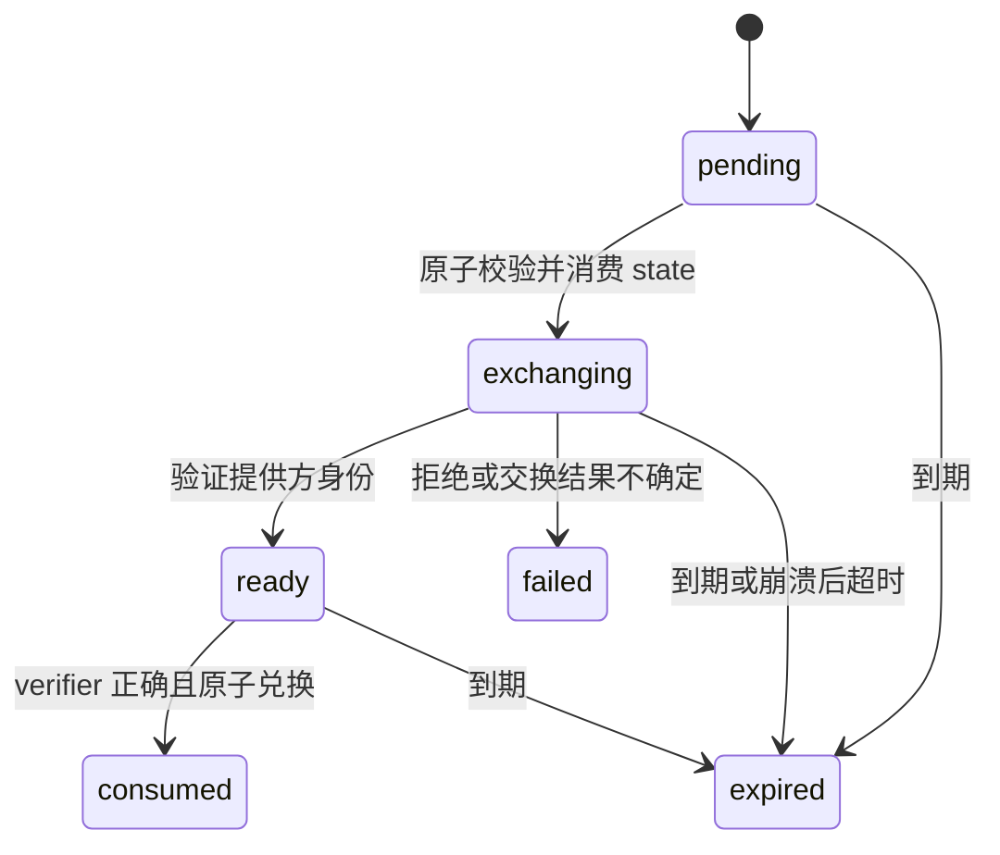

# 51 · 后端身份与内容闭环合同设计

> 状态：DRAFT · 设计方向已采用，机器合同未冻结，非 DEV-M2 开工或真实接入批准。
> 日期：2026-09-08。范围依据：本轮用户同意继续治理合同设计；先后端闭环，桌面随后。
> 本文拥有本次增量草案；既有正式合同见 [39](39-API合同与发布状态机-v1.md)、[DDL](33-schema-v1-草案.sql)、[NFR](41-NFR扩展并发与防改崩.md)。不覆盖既有签名或不可变合同导出。

## 1. 交付行为与边界

首个切片在单主机合成环境跑通：模拟身份登录 → 持久接收 CSV/XLSX → worker 解析并冻结待审对象 → 有资格的人工审核 → worker 完成 staging → 发布 → current/snapshot/ACK 和检索 → 暂停、到期、回退拒绝或生效。桌面、真实飞书提供方、真实业务资料、自动发送和部署不属于本设计的首次实现范围。

选择 API 持有产品会话、独立 worker、PG outbox 和单主机共享持久卷；不选客户端直接使用提供方 token，也不选 API 内存任务队列。身份、持久接收、审核权限和 finalizer 各有唯一所有者，调用方不自行拼接数据库事务或信任上传的审核字段。

## 2. 身份协议

所有新 JSON 对象封闭字段；时间为 UTC RFC3339，期限按数据库时钟判定。产品错误使用既有 error envelope，新增 reason 在机器合同增量中登记。此处路径是待冻结设计，当前服务并不存在这些新路由。

| 方法 / 路径 | 请求字段 | 成功响应字段 |
| --- | --- | --- |
| POST /v1/auth/login-requests | client_challenge（base64url SHA256，43 字符）、challenge_method（仅 S256） | 201：login_id、authorize_url、expires_at |
| GET /v1/auth/callback | code + state，或提供方 error + state；两种互斥 | 200 固定完成页，不含凭据；失败页不回显提供方原文 |
| POST /v1/auth/login-requests/{login_id}/exchange | client_verifier（43–128 个 RFC7636 unreserved 字符） | 202：status=pending、retry_after_seconds=2；或 200：access_token、token_type=Bearer、expires_at |
| POST /v1/auth/logout | 空请求体，产品 Bearer | 204；重复退出无副作用 |
| GET /v1/me | 产品 Bearer | 沿用既有公开用户投影，不新增提供方 token 或审核角色字段 |

随机生成 login_id、state、会话 token，不使用可预测序号作为秘密；state/token 至少 32 字节随机熵。登录请求 5 分钟到期。authorize_url 由服务端预配置提供方、client ID 与固定 callback 生成，不接受客户端 redirect URI、tenant 或角色。

exchanging 显式隔离网络交换；数据库锁不跨网络调用。重复 callback 不再交换 code；ready/consumed 返回固定已处理页，exchanging 返回处理中。服务重启发现未完成 exchanging 不重试一次性 code，最终超时并要求重登。合法 state 对应的提供方拒绝写 failed；未知 state 不改变任何请求。

产品兑换与会话插入同事务：并发兑换至多一条会话成功。响应丢失后重复兑换返回 409 LOGIN_CONSUMED，要求新登录；不能从摘要恢复 token。兑换错 verifier、未知 ID 使用相同 400 LOGIN_INVALID，不泄漏请求存在性；到期返回 410 LOGIN_EXPIRED。所有认证响应使用 Cache-Control: no-store；回调页无第三方脚本，Referrer-Policy: no-referrer，不向外部跳转。

产品会话绝对期限 15 分钟，不自动续期；不保存提供方 refresh token。飞书撤销的残余会话窗口最多为剩余产品期限，不承诺即时同步。退出、用户禁用或角色变化在下一次认证时从数据库检查；已开始事务不承诺被远程中断，审核/发布等写事务在授权函数中再次确认当前资格。无会话/过期/撤销返回 401，身份有效但角色缺失或能力不足返回 403。数据库故障返回 503，不回落 mock。

真实 provider wire 仍待官方参数核验；模拟提供方只能由显式合成配置启用。产品 challenge 不等于飞书端已支持 PKCE。OAuth 实现必须另行核验提供方 code 绑定、issuer/tenant/subject、redirect 与 PKCE 行为；未完成不得打开真实 profile。

## 3. 身份持久模型与权限

| 候选表 | 最小字段与约束 | 写入者 |
| --- | --- | --- |
| auth_login_requests | id 主键；state_hash 唯一；challenge；status；expires_at；exchange_started_at；subject_ref 可空；consumed_at；状态组合 CHECK | 身份服务受限函数 |
| auth_subject_bindings | provider + tenant + subject 唯一；内部 user_id；enabled；role；authorization_version | 受控身份管理能力；登录不可自动提权或自助建映射 |
| auth_sessions | token_hash 唯一；user_id；login_request_id 唯一；issued_at；expires_at；revoked_at；expires_at > issued_at | 身份服务受限函数 |
| auth_capability_bindings | user_id + capability 唯一；enabled；version；登记审计引用 | 独立受控配置流程；客户端不可写 |

公共 agent/coach/owner 不等同于 ROLE-CONTENT-LEAD、ROLE-CS-MANAGER。审核资格由 capability 映射额外验证，不能凭 owner 自动双审。模拟环境采用两个不同合成主体验证双人约束，不替用户制造真实审核人。

runtime 仅认证与读取公开用户，不得 SELECT token 摘要表或写 capability；审核池仅调用允许的审核记录函数；worker 不得写任何审核决定。新函数 SECURITY DEFINER 时固定 search_path、撤销 PUBLIC 执行权限并对 SQL 注入与角色混用做负例。具体 GRANT/REVOKE 在 DDL 增量内冻结。

## 4. 审核入口与等待恢复

选择受限 CLI → 管理 HTTP → 审核池，不向 CLI 发数据库连接串。CLI 从交互登录获取会话，秘密不放命令行参数；审核主体只取服务端身份。公开 search/snapshot 不增加审核主体、证据内部地址或上传原文。

| 候选管理入口 | 行为 |
| --- | --- |
| GET /v1/admin/content/reviews?cursor=...&limit=... | 列表分页默认 20、最多 100，返回 batch_id、review_revision、状态和计数；cursor 不接受任意查询 |
| GET /v1/admin/content/reviews/{batch_id} | 授权后读取不可变候选、冻结计划及抽样键；正文仅在该受限投影，日志不记录正文 |
| POST /v1/admin/content/reviews/{batch_id}/decisions | Idempotency-Key；review_revision、script_id、content_hash、decision=approved/rejected、evidence_id；主体和角色禁止由 body 提交 |
| POST /v1/admin/content/reviews/{batch_id}/quality-evidence | Idempotency-Key；review_revision、plan_id、population_manifest_hash、样本检查结果及 evidence_id；服务端计算计数和 passed/blocked，不采信客户端总数或通过布尔值 |

evidence_id 是受控引用标识，不接受任意 URL。幂等键按主体/操作作用域唯一，正文使用确定性摘要；同键同内容返回原公开结果，同键异内容返回 409 IDEMPOTENCY_CONFLICT。过时 revision/hash 返回 409 REVIEW_STALE；主体无资格返回 403；缺必需双审、quarantine 或质量阻断按现有发布门拒绝，不借审核入口绕过。

**待审产物是本轮需要新增的明确合同。** 既有 finalizer 需要审核事实，不能先伪造通过再展示给人看，也不能持有 worker lease 等几天。新增不可变 review artifact 及其 batch/revision/content digest/population digest 数据库索引；完整候选仅保存在受控持久卷，引用经过服务端验证。它不是 release 或 staging，绝不进入搜索。

解析 worker 用 fenced 短事务登记 review artifact、冻结质量计划，并将验证任务转为待审核暂停态，释放 lease。具体新增 outbox 状态或独立 review-wait 表由 DDL 采用独立 review-wait 表方案：保持既有 outbox 状态枚举，新增受限 park/resume 函数，以同一事务完成旧任务停放与等待登记，避免直接调用未授权的通用 complete。人工等待不消耗失败重试次数。

审核完成后，受限 resume 函数在同事务内校验必要决定、质量证据和当前 revision，创建唯一后续 import_validate 工作项并标记等待已唤醒；重复提交不重复排队。worker 重新 claim 后重读不可变候选，核对字节摘要、来源、取消状态、population 和审核事实，调用既有 fenced finalizer。取消与 resume 使用同一 batch 锁顺序；取消后不得新建任务或 staged。进程崩溃发生在提交前则整体回滚，提交后按持久状态继续。

既有内容审核函数和质量函数仍是事实入口；新增 park/resume 不能授予 worker 记录审核的能力。该接口增量是 T0 冻结前必做项，现有数据库尚无此新增协议，禁止只靠文档假定可运行。

## 5. 接收、资源与清理

单主机 API/worker 共用持久存储命名空间。上传经过限量流式写、扩展名/MIME/结构安全校验、摘要、文件和目录持久化、原子归位、可读验证，再以 batch+outbox 同事务提交后返回 202。文件原名只作展示，不参与存储路径。原始上传与规范化 review artifact 用不同内部对象类型，均禁止 public 投影。

候选预算：上传 10 MiB / 30 秒；XLSX 累计解压 50 MiB / 128 条目；单文件最多 5,000 数据行；解析 60 秒且能实际终止；并发 worker 1；lease 60 秒、heartbeat 20 秒；异常尝试沿用 5 次。字段长度用现行 schema。API/worker 所有能力池合计最多 20 个连接，连接等待 2 秒；既有 statement timeout、发布全局锁和限流沿用 NFR。

新增入口限流草案：login 创建 10/min/受信客户端网络标识且单实例总计 60/min；兑换 30/min/login_id 加同一网络桶；审核写 30/min/user，读 60/min/user；导入 5/min/user 且同时最多 2 个上传。429 带 Retry-After；不信任任意 X-Forwarded-For，不把提供方 subject 或原始 IP 写入业务审计。单实例限制不能冒充集群总量，扩实例前必须换共享限流策略。

存储失败 503 STORAGE_UNAVAILABLE；上传超限 413 IMPORT_TOO_LARGE；不支持媒体 415；结构错误 422；解析超时形成受控失败报告。仍按既有 source denial 独立短事务审计，不把这些错误误记成来源拒绝。已落盘但未入库对象作为孤立对象候选；合成环境回收宽限期 24 小时，删除前再次验证无引用。真实保留/删除周期未定，真实 profile 因此继续禁用。审核对象有 batch/证据引用时不得按临时对象删除。

## 6. 必须通过的合同例子

| 场景 | 预期 |
| --- | --- |
| 两个 callback 同时到达 | 至多一次提供方交换；无双重会话 |
| 兑换成功但客户端断线，再次兑换 | 409；不得重新生成第二条会话 |
| 正确身份提交 owner/审核人字段 | 封闭 schema 拒绝；不提升权限 |
| 用户禁用后提交审核 | 403 或会话 401；不得追加决定 |
| 上传成功、enqueue 事务失败 | 不返回 202；无 batch/outbox 半成品 |
| review artifact 同计数换一行 | 摘要/总体 hash 校验拒绝 |
| 人工审核跨越多次 worker lease | 等待不耗重试；审核后仅一次恢复任务 |
| 取消与最后一条审核并发 | batch 锁串行；取消后不得 staged |
| 同主体承担两个高风险角色 | 拒绝双审通过 |
| 审核者伪造样本总数或 passed | schema 拒绝；由逐项检查结果计算 |
| resume 提交后进程崩溃 | outbox 可恢复；旧 lease 不可 finalizer |
| 发布后来源暂停、旧缓存命中 | 搜索/快照按现有来源门拒绝 |
| 文件超过限额一字节或解析超时 | 有界失败；不继续后台无限解析 |

以上为设计验收，尚未运行。实现时须补充 PG 并发/ACL、HTTP 封闭 schema 和实际 API/worker 产物端到端测试，不以此表替代 PASS。

## 7. 交接与未冻结项

本轮完成可审阅设计：协议、数据所有者、审核等待恢复、失败语义和验收输入。下一环节在现行 OpenAPI/DDL 真源形成版本增量，并复核新审核等待协议与既有 outbox capability 的兼容性；之后绑定治理提交和双哈希，由产品仓正式 intake。旧锁定快照不变。

真实提供方参数核验、真实审核主体登记、真实保留政策、DEV-M2 开工和运行接入分别保留其批准边界。设计授权不等于 commit、push、合并、部署或正式合同已签发。机器合同尚未生成，因此本文当前不能直接作为产品迁移输入。

## 8. 三项合同补齐结果

[机器候选目录](../30-开发-进行中/backend-runtime-candidate/README.md) 拥有最新 OpenAPI、存储与事务增量及运行命令。审核详情分页、受限登录/审核/恢复函数、统一内容事务锁已落成候选。前文独立等待表方案保留；最终锁方案使用 12 个既有内容入口共同取得事务级锁，以降低重写旧业务函数的风险，代价为首轮内容写串行。

质量操作不再重复传入 plan_id/population_manifest_hash，由不可变 revision 绑定；分页不再使用待定 cursor，使用 revision + after。样本计算与缺陷处理边界见候选 README，内容决定沿用 approved/rejected，质量 passed/blocked 与需扩样、需新修订状态分别表达。

已验证：隔离 PG15 安装、登录重复消费/撤销、审核回执、角色与跨能力拒绝、分页、质量覆盖/质量门、异人审核缺证据拒绝、恢复/取消，以及两个连接的内容锁互斥。静态及这些针对性行为检查不代表完整端到端发布、所有并发恢复矩阵或真实身份运行已验收。合同仍为 DRAFT，未冻结。

下一步为治理仓提交与阶段批准后的正式版本组合；当前没有产品仓 intake，也没有运行接入或 DEV-M2 批准。
